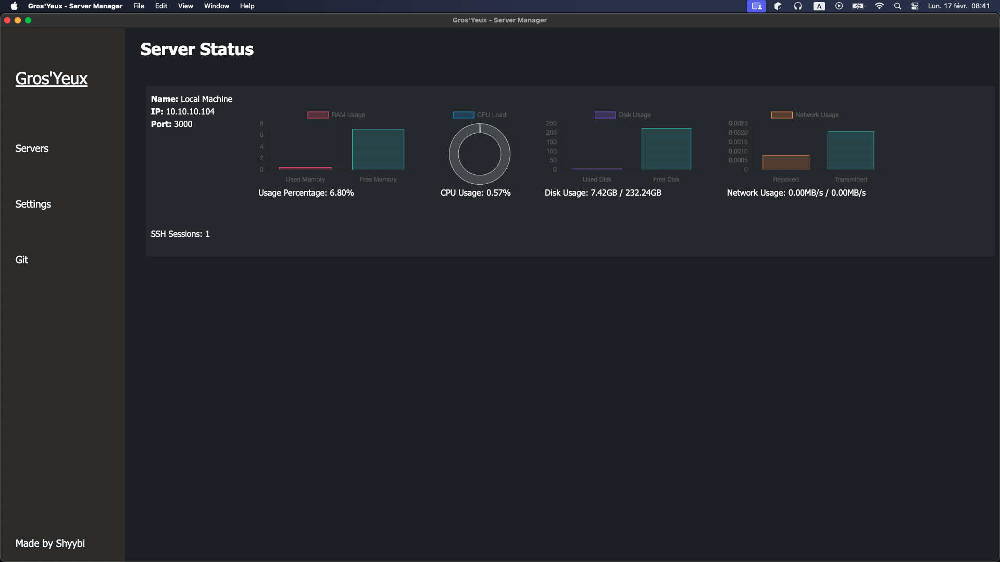
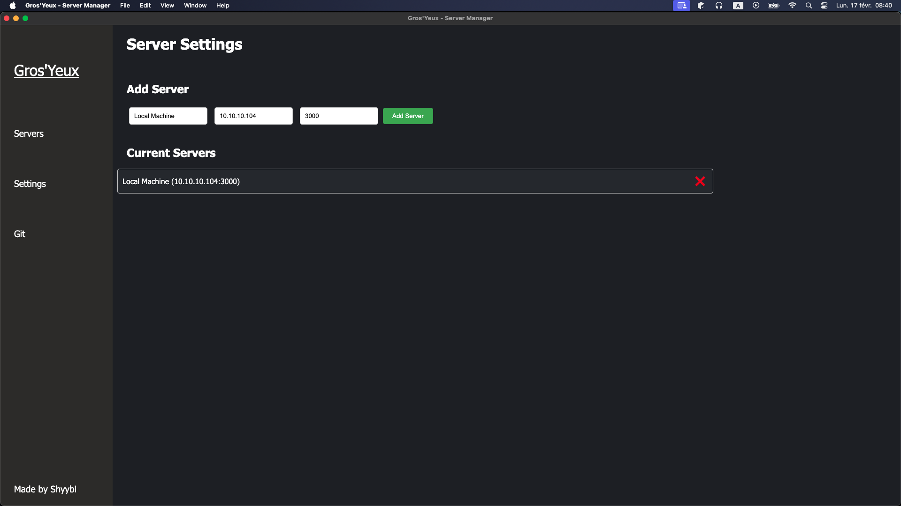

# Gros'Yeux

Gros'Yeux - a Mini Datacenter Dashboard Manager to manage my server room 

##  Pre Installation 

1. Download [NodeJS](https://nodejs.org/)

## Installation

1. Clone the repository
2. Run the command " npm install "
4. Run the build.

    For windows: `npm run build:win`    
    For linux: `npm run build:linux`    
    For mac: `npm run build:mac`    
5. in the dist folder, you will find the overlay for your OS. (the folder : `*/dist/*-unpacked/` )

## Setup server-side 

1. Download [Gros'Yeux Service Api](https://github.com/shyybi/gros-yeux-service-api)
2. Execute the instruction on the git repository

## Screenshots

The Status page

The Settings page

